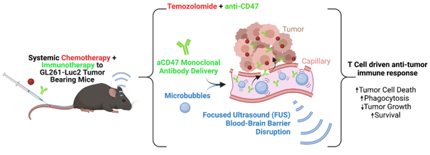

```{r setup, echo=FALSE, message=FALSE, warning=FALSE, results='hide'}
library(tidyverse)
library(ggpubr)
library(ggtext)
knitr::opts_chunk$set(echo = TRUE)
```


# 1. Experiment Info / Rationale

* Glioblastoma is an aggressive primary brain tumor with many barriers to treatment


* **Focused Ultrasound (FUS)** disrupts the blood-brain barrier to facilitate brain penetration of drugs
  + Improves *drug delivery* to brain tumors, *tumor growth control*, and *survival*
  
  
* **Combination therapy** is well-established as an improved cancer treatment strategy over monotherapy 


* Study design:
  + GL261-Luc2 glioma-bearing mice
  + treat with **FUS in addition to combination therapy** of systemic temozolomide chemotherapy & anti-CD47 monoclonal antibody immunotherapy
  + monitor tumor volume over time by MRI 
  

In this project, we compared **tumor volume** of **untreated** glioma-bearing mice with **combination-treated** glioma bearing-mice at day 20 post-tumor implantation. 



\newpage
# 2. Load & Tidy Data

To tidy the dataset, we removed `Experiment 6` because it tested different drugs than `Experiment 5` and the data are incomplete (`Day_20_Tumor_Volume` and weight values are missing). We also removed the `Combo` treatment group from `Experiment 5` because we are interested in the `Combo+FUS` group only.


```{r, message=FALSE, warning=FALSE, results='hide'}
# load from csv
df <- read_csv("8380_Tumor_Data.csv")
```


```{r}
# tidy dataframe by removing unneeded observations
df <- df %>% filter(Experiment_Number != 6 & Treatment_Group != "Combo")

# relevel treatment group factor so order is correct in plots later on
df <- df %>% 
        mutate(Treatment_Group = factor(Treatment_Group)) %>%
        mutate(Treatment_Group = fct_relevel(Treatment_Group, 
                                             c("Untreated", "Combo_FUS"))) %>%
        arrange(Treatment_Group)
  
# preview cleaned data
glimpse(df)

```

\newpage

# 3. Evaluate Data 

We want to examine the difference in tumor volume at day 20 between untreated and treated mice. First we assessed these data to help us decide what statistical tests would be appropriate.

```{r}
# check normality
p_qq <- df %>% 
          ggplot(aes(sample = Day_20_Tumor_Volume, color = Treatment_Group)) + 
          geom_qq(show.legend=FALSE) + geom_qq_line(show.legend=FALSE) +
          facet_wrap(~Treatment_Group) +
          labs(title = "Normality of Day 20 Tumor Volume by Treatment Group") + 
          theme_classic()
p_qq


# check within-group variance / distribution with density plot
p_dens <- df %>% 
            ggplot(aes(x = Day_20_Tumor_Volume, fill = Treatment_Group)) + 
              geom_density(alpha = 0.5) +
              labs(title = "Day 20 Tumor Volume by Treatment Group",
                   x = expression(paste("Tumor Volume (mm" ^ 3, ")" ))) + 
              theme_classic()
p_dens

# check within-group variance with descriptive statistics
summary_stats <- df %>% 
                    group_by(Treatment_Group) %>% 
                    summarize(n = n(),
                              median = median(Day_20_Tumor_Volume),
                              mean = mean(Day_20_Tumor_Volume), 
                              stdev = sd(Day_20_Tumor_Volume),
                              variance = var(Day_20_Tumor_Volume)) 

summary_stats
```

\newpage

# 4. Statistical Analysis
Based on the exploratory plots and our knowledge of the experiment design, we determined that these data are normally distributed, are independent samples, and that the two groups have non-equal variances.


### Therefore, we used an **unpooled t-test** to test our hypothesis about tumor volume at day 20:
  * $H_0: \mu_{combo+FUS} = \mu_{untreated}$
  * $H_1: \mu_{combo+FUS} /ne \mu_{untreated}$
  * $\alpha = 0.05$

```{r}

#run unpooled t-test to compare mean of day 20 tumor volume between untreated & combo+FUS
t.test(Day_20_Tumor_Volume ~ Treatment_Group, data = df, var.equal = FALSE)

```

## 5. Conclusion: 

We reject the null hypothesis for the unpooled t-test, given that $p=0.004$ is less than $\alpha=0.05$.  The difference is illustrated in the stripchart below, where the treated mean is markedly lower than the untreated mean, with no overlap between the 95% confidence intervals. **Therefore, we conclude that mice treated with combo+FUS have smaller tumors than untreated mice after 20 days.**


```{r}

# use ggpubr to make pretty plot 
# display individual data points, group means & 95% CIs, and the t-test result


p <- df %>% ggstripchart(
  # assign aes() parameters
      x = "Treatment_Group", y = "Day_20_Tumor_Volume", 
      color = "Treatment_Group", size = 3,
  # plot mean & 95% CI overlaid on stripchart of individual datapoints
      add = "mean_ci",
  # format plot visualization of mean & CI
      add.params = list(color = "black", width = 0.4), error.plot = "crossbar",
  # set plot labels
      title = "Effect of treatment on tumor volume",
      subtitle = "Day 20 tumor volumes of individual mice with mean & 95% CI",
      xlab = "Treatment Group",
      ylab = "Tumor Volume (mm<sup>3</sup>)") +
  # use markdown theme for simple superscript in axis label
  theme(axis.title.y = element_markdown()) + 
  # hide legend
      rremove("legend") +
  # annotate plot with pvalue from unpooled, unpaired t-test
      stat_compare_means(method = "t.test", 
                         method.args = list(var.equal = FALSE, paired = FALSE),
                         label.x.npc = "right")

p

```


```{r, message=FALSE, warning=FALSE, results='hide'}
# export plots and table for use in presentation

ggexport(p, filename = "plot.png")
ggexport(p_qq, filename = "qq_plot.png")
ggexport(p_dens, filename = "density_plot.png")

# arrange/prep summary statistics for pretty table, then export
summary_stats %>% 
  column_to_rownames(var = "Treatment_Group") %>%
  round(digits = 1) %>%
  ggtexttable(theme = ttheme("light")) %>% 
  tab_add_title(text = 
                  expression(paste("Day 20 Tumor Volume (mm" ^ 3, "): summary statistics")), 
                face = "bold") %>%
  ggexport(filename = "stats_table.png")

```


